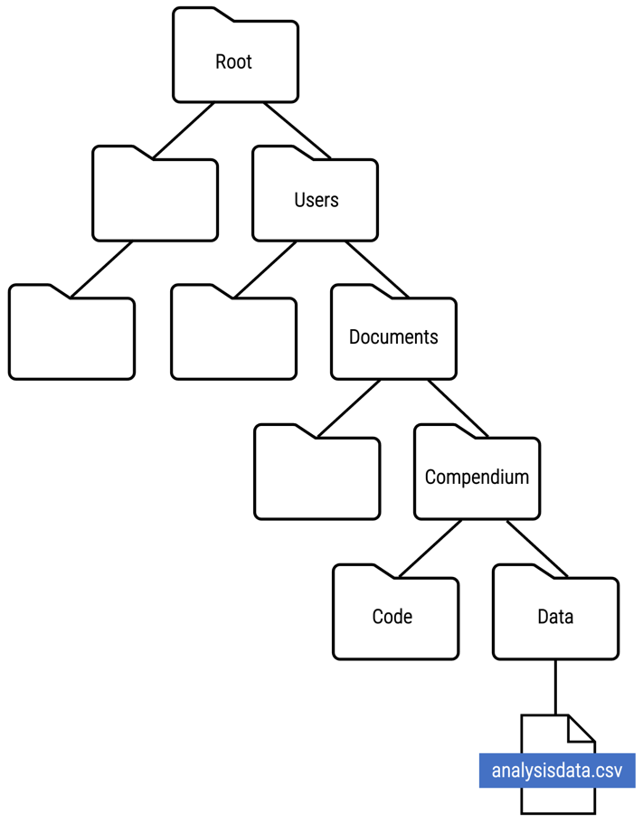
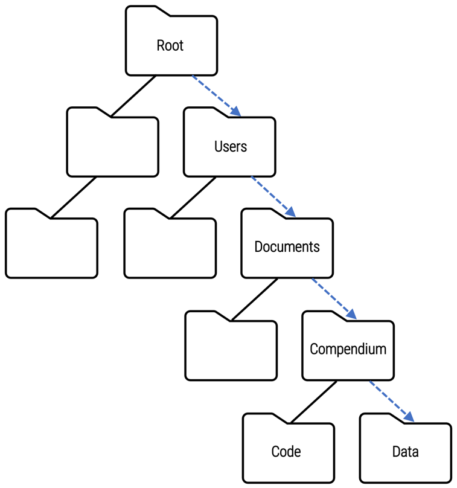

::::::::::::::::::::::::::::::::::::::: objectives

- Understand how code documents the analytical workflow
- Identify the essential metadata that should be included in a code header to support reproducibility
- Explain the importance of non-executable comments for reproduciblity
- Understand what a main file is and how it contributes to reproducibility
- Evaluate code quality based on whether or not it upholds the reproduciblity standard of being both independently understandable and reusable

::::::::::::::::::::::::::::::::::::::::::::::::::

:::::::::::::::::::::::::::::::::::::::: questions

- What is the purpose of a code inspection?
- Which elements of code support reproducibilty?
- How do these elements of code support reproducibility?

::::::::::::::::::::::::::::::::::::::::::::::::::

Assessing the reproducibility of scientific claims involves an exhaustive list of curation actions, which are outlined in the Data Quality Review (DQR) framework introduced in [Lesson 2: Curating for Reproducibility Workflows](https://curating4reproducibility.org/cure-carpentry-02-workflows/) of the Curating for Reproducibility Curriculum. DQR organizes these curation actions into four components--file review, documentation review, data review, and code review--each of which promote reproducibility by ensuring the completeness, accuracy, understandability, accessibility, and usability of the research compendium.

Code review, in particular, puts reproducibility to the test by verifying whether or not repeating the analytical steps used by the original researcher produces the same results reported in the published study. This assessment of reproducibility begins with a thorough code inspection.

## Code Inspection Overview

Ideally, researchers, who know their work best and have direct access to all the necessary details of their analytical workflow, would inspect their code before they share it to be sure that all of the scripts needed to load software packages, import and transform data, and produce outputs are included in code files. They would review their code to be sure that computing environment requirements and the expected runtime are specified in code header metadata and that non-executable comments are included throughout the code to serve as signposts for the analytical workflow by indicating the purpose of commands. They would also confirm that their files render properly, and re-run their code (preferably on a machine other than the one used to perform the original analysis) to be sure that the code compiles properly and executes the analysis from beginning to end without errors.

Unfortunately, it is not always the case that researchers review their code for understandability and executability prior to packaging it into the research compendium and sharing it.  Thus, the first step of any reproducibility assessment is to inspect the code and confirm that it includes the following:

- Sufficient information to enable users to re-create the computing environment originally used to run the analysis and produce the reported results
- Details about the analytical workflow that allows others to understand and re-trace the computational steps to produce expected outputs
- Scripts for installing necessary software tools and importing data that take into account independent reuse of the code by researchers other than those who initially wrote the code and ran the analysis

## The Analytical Workflow

By its very nature, the analytical workflow of computational research is captured in the code that contains the commands to install software package dependencies, import and transform data, and execute scripts to analyze data and produce results.

It is also the nature of research that analytical workflows are rarely linear, which is often reflected in code that produces outputs in a different order than the order in which they are presented as research results in the manuscript. This makes it necessary for the code to provide signposts to allow others to retrace the analytical steps.  These signposts should appear in the code as non-executable comments found in code header metadata and throughout the code.

### Code Header Metadata

When inspecting the code, it should be evident the technical requirements for running the code successfully.  This information is presented as code header metadata, which is a block of non-executable text positioned at the top of the code before any command scripts.

Below in an example of code header metadata:

```source
************************************

*Title of the paper: Smallholder Farmers and Contract Farming in Developing Countries 
*DOI:  https://www.pnas.org/doi/full/10.1073/pnas.1909501116

*Authors: Eva-Marie Meemken and Marc F. Bellemare 
	 *Corresponding author: Eva-Marie Meemken 
	 *Contact details: Cornell University and University of Minnesota. 
	 *Warren Hall, Ithaca, NY 14850.
	 *Phone: +1 607 319 1121. email: emm253@cornell.edu 
	
*Code last updated: 11/01/2019
*Software and version: STATA 15 MP, Run on Windows 10, 64-bit

*Code last executed for maintenance review:  
*-22 APR 2022
*-Software and version: STATA 17 MP 
*-Operating system:  Microsoft Windows Server 2019 Datacenter, Version 10.0.17763 Build 17763, 64-bit
*-Processor:  Intel(R) Xeon(R) CPU E5-4669 v3 @ 2.10GHz, 2095 Mhz, 10 Core(s)
*-Processing job completed in under 2 minutes using the above computing environment.

************************************
```

Code header metadata should provide enough information to allow others to recreate the computing environment used to run the analysis. It should also specify acceptable uses of the code with a license, and provide contact information for the creator(s) of the code in the event that challenges arise when attempting to reproduce the analysis.

:::::::::::::::::::::::::::::::::::::::  checklist

## Checklist: Code Header Metadata

This checklist outlines the specific information that should be included in code header metadata for every code file.  A code inspection should confirm the presence of each item in the checklist.

- Formal citation for the article that presents the results produced from the code
- Author contact information including email, affiliation, and ORCID
- Code license that specifies allowable uses and conditions for use of the code
- Computing environment specifications:
  - Operating system and version
  - Number of CPUs/cores
  - Size of memory
  - Statistical software package and version
  - Packages, libraries, and other software dependencies and their versions
- File encoding
- Date that the code was last updated
- Date that the code was last run successfully
- Estimated time to run the code from beginning to end  
  

::::::::::::::::::::::::::::::::::::::::::::::::::

:::::::::::::::::::::::::::::::::::::::  challenge

## Exercise: Code Header Metadata Inspection

Review the sample code and identify each piece of information outlined in the Code Header Metadata Checklist.

:::::::::::::::  solution

## Solution

solution

:::::::::::::::::::::::::

::::::::::::::::::::::::::::::::::::::::::::::::::

### Non-executable Comments

The code header metadata is an example of non-executable comments that also appear elsewhere in the code.  Non-executable code comments are lines of human-readable text that can be placed throughout the code without interfering with command scripts that perform analysis workflow actions.

Non-executable comments are like a "note to self" that tells researchers what the code is doing and why.  These annotations remind the researcher who originally wrote the code of the analytical workflow they used to generate their research results, while also making this information clear to other researchers. Code comments that support reproducibility often include explanations of what lines or blocks of code are meant to do or what outputs the code should produce.

The syntax for non-executable comments often uses a specified symbol or combination of symbols (`*`, `//`, `/**`, or  `#` depending on the programming language) placed before the comment text, which signals to the software program that the text should be ignored.

The example below show examples of non-executable comments inserted in the code:

{alt='Examples of non-executable code comments'}

:::::::::::::::::::::::::::::::::::::::::  callout

## Spotlight: Sometimes Less is More

During the research process, it is not uncommon for blocks of code used to process and analyze data to gradually grow in size as researchers rework or broaden their approach.  Oftentimes, these code blocks end up including lines of code that are no longer required to run the analysis and possibly produce unnecessary outputs.

Some researchers may decide that the unneeded code has some potential to be useful, whether to document previously used analytical steps or to be used in subsequent analyses.  In these cases, these lines of code are not deleted, but instead commented out so that they are no longer executable.

On the other hand, if the code has no role in the analysis and no potential value, it is preferable that this extraneous code be deleted entirely to reduce the amount of lines of code that need to be inspected.


::::::::::::::::::::::::::::::::::::::::::::::::::

### The Main File

In some cases, the analysis workflow is complex enough to require more than one code file to produce results.  For research compendia that contain more than one code file, it is highly recommended to use file names that indicate the order in which they must be run and/or provide this information in the README file (see Episode 3: Documentation Review in [Lesson 2: Curating for Reproducibility Workflows](https://curating4reproducibility.org/cure-carpentry-02-workflows/) in the Curating for Reproducibility curriculum for more on the README file).

Use of a **main file**, while not a strict requirement, can do even more to enhance reproducibility.  A main file, when executed, runs all of the other code files in the research compendium in the proper sequence to generate all of the tables, figures, and in-text results presented in the manuscript. It also provides an overview of how the code files are interconnected, which makes it easier to understand and re-trace the analytical workflow.  This makes the main file the starting point for fully automated push-button reproducibility, which is what curating for reproducibility hopes to achieve.

Below is an example of code contained in a main file that includes commands to run code files in the proper order:

```source
sysdir set PLUS ../Prerequisites
*ssc install estout
*ssc install xtqreg

do "1_1_household level data set.do"
do "1_2_multiple respondents per household.do"
do "2_1_merging hh level data all countries.do"
do "2_2_merging multiple responses data all countries.do"
do "3_1_merging all data sets all countries.do"
do "4_Main analysis.do"
do "5_SI Appendix.do"
	
log close
```

:::::::::::::::::::::::::::::::::::::::::  callout

## Spotlight: Our Language Choices

The **main file** may be more familiar to some people as the *master file*.  While master file is the term that has been adopted to refer to the file containing code that initiates execution of code files in the correct order, this term is falling out of favor.

Many in the tech community are recognizing the terms such as "master" and "slave" are racially-loaded terms that can be offensive to Black people, who are underrepresented in tech community.  By adopting more neutral terms such as *main*, *primary*, or *parent* for master and *secondary*, *follower* or *child* for slave, unnecessary references to slavery is avoided.

Such attention to language choices is an important step towards increasing diversity and inclusion in tech and in other disciplinary domains.

::::::::::::::::::::::::::::::::::::::::::::::::::

## Software Dependencies

In some cases, researchers have found that statistical software programs lack functions for performing certain analytical operations. Adept researchers have written custom code themselves and organized it into a reusable package for sharing. This allows other researchers using the same analytical approaches to access and install the package into their own computational environments.

If a study requires the use of certain packages to run the analysis, the research compendium should document this software dependency.  In addition, the code should not assume that users already have the packages installed and loaded.  Rather, the code should include installation scripts for required packages.

When inspecting the code, look for commands that install and load packages into the program environment such as `install.packages("package_name")` or `library(package)`.

## Data Import

A key function of the code is to point the software program to the data to be used in the analysis, whether that data are included in the research compendium, or are accessed from an external source.  The code inspection examines the commands for reading the data file(s) to determine if the code clearly indicates which data files are used in the analysis and where they are located.  The inspection also checks to see whether the commands are written in a way that enables others to re-run the code without the need to make modifications to make it work correctly.

### File paths

A file path is used to specify the location of a file within a directory structure.  Take a look at where the `analysisdata.csv` file is located within the directory structure below:

{alt='Data file within a directory structure'}

File paths are represented as a slash-separated list of the folder names followed by the file name, and can be written as either an absolute file path or relative file path.

**Absolute file paths**  
`C:\Users\Documents\Compendium\Data\` is an absolute file path that indicates the folder location of the `analysisdata.csv` file in relation to a specific root folder and all of the subfolders along the way.

{alt='Absolute file path'}

If the name or location of any one folder along the directory structure changes, the path will be broken, and the code will fail to read the data file. Moreover, using an absolute file path assumes that other users will have the same exact directory structure, which is not likely to be the case.

**Relative file paths**  
`../Compendium/Data` indicates the folder location of the `analysisdata.csv` file relative to the current directory of the computing environment being used at the moment to run the code.  This relative file path depends on folder names and locations of only part of the directory structure.

{alt='Relative file path'}

The recommended practice is to use relative file paths instead of absolute file paths because they are  constructed in a way that facilitates reproducibility.  Relative file paths anticipate re-use of the code by other researchers who will certainly use computing environments with varying directory structures.

:::::::::::::::::::::::::::::::::::::::  challenge

## Exercise: File Paths

To ensure that the analysis code executes successfully in any computing environment, relative file paths should be used to import data.

The R script to load data below uses an absolute file path. To support reproducibility, convert the absolute file path into a relative file path.

```source
read.csv ("C:/Users/Documents/PopStudy1/Data/AnalysisData/pop1_analysis_data.csv")
```

:::::::::::::::  solution

## Solution

```source
read.csv ("./PopStudy1/Data/AnalysisData/pop1_analysis_data.csv")
```

:::::::::::::::::::::::::

::::::::::::::::::::::::::::::::::::::::::::::::::

## Putting It All Together

To assess whether the code upholds the reproducibility standard of being both ***independently understandable*** and ***reusable***, code files must undergo an initial inspection to identify any issues that can make reproducibility difficult or impossible.  The Code Inspection Checklist below outlines the specific tasks involved in a thorough inspection.

:::::::::::::::::::::::::::::::::::::::  checklist

## Checklist:  Code Inspection

- Does the code file open and render properly?
- Does the code include the following components:
  - Code header metadata
  - Non-executable comments
  - Package installation scripts
  - Data import commands
  - Variable transformation scripts
  - Data analysis commands
  - Log commands
- Does the code header metadata include all essential information needed to run the analysis (see the Code Header Metadata Checklist above)?
- Do non-executable comments provide signposts for the analytical steps in the computational workflow?
- Do data import commands use relative file paths instead of absolute file paths?
- If the research compendium contains multiple code files, do the filenames indicate the order in which the code files should be executed?
- If the research compendium contains multiple code files, is there a main file included in the compendium?
  

::::::::::::::::::::::::::::::::::::::::::::::::::


:::::::::::::::::::::::::::::::::::::::: keypoints

- Code inspection is the first step in reproducibility assessment.  The inspection provides important information about the analytical workflow, computational requirements, and input data.
- A main file contains essential code that facilitates reproducibility when more than one code file is required to repeat the analysis.  The main file acts as the starting point in fully-automated push-button reproduction by running all code files in the proper sequence.
- By provding the author's contact information, computing requirements, and licensing terms, code header metadata signals to users of the author's transparency and willingness to assist with reuse.
- Non-executable comments in the code serve as a roadmap of the analytical workflow by identifying code segments and their purpose.

::::::::::::::::::::::::::::::::::::::::::::::::::


