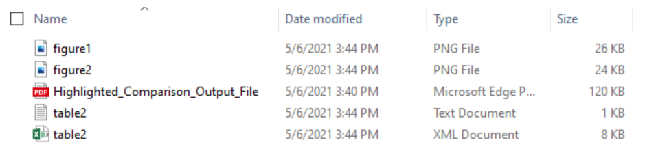
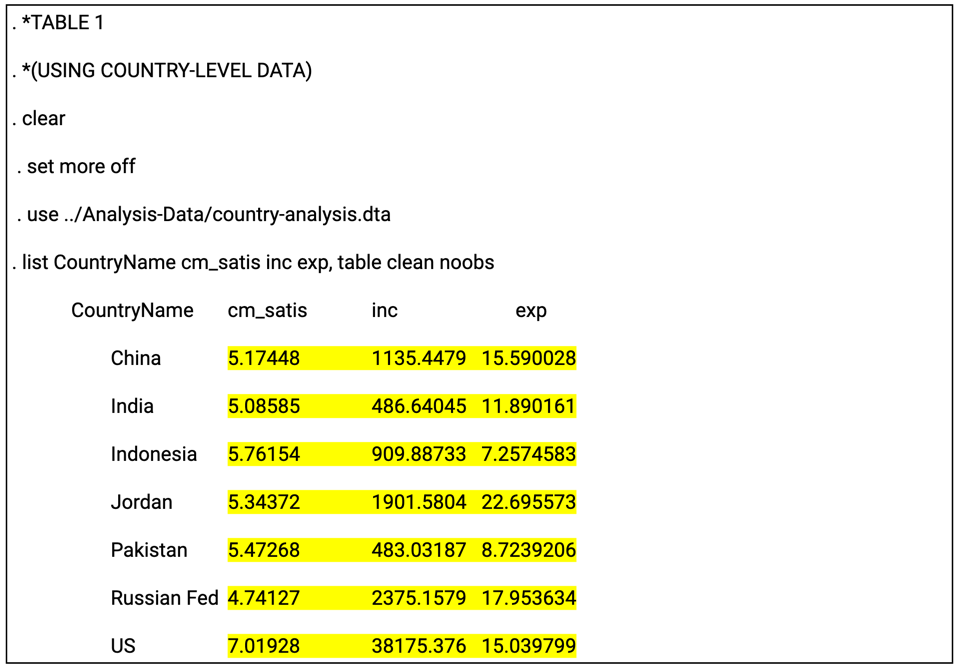
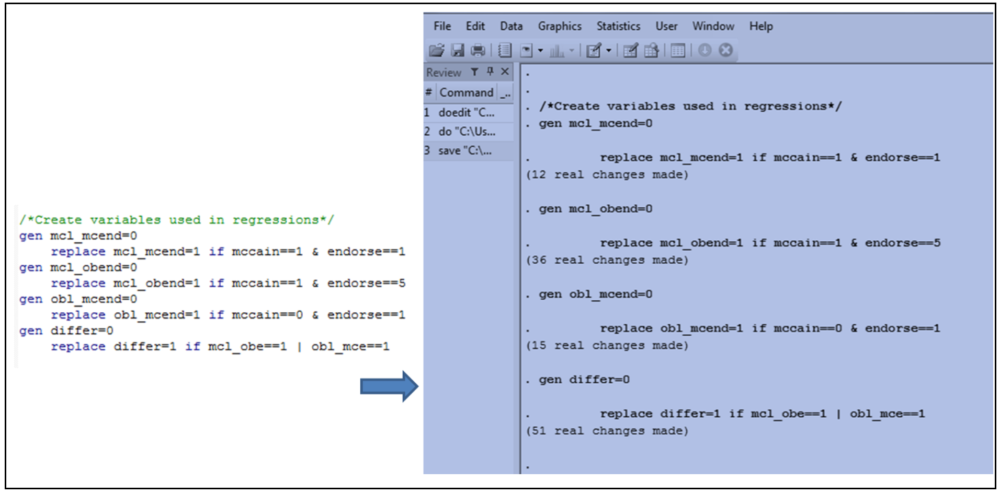
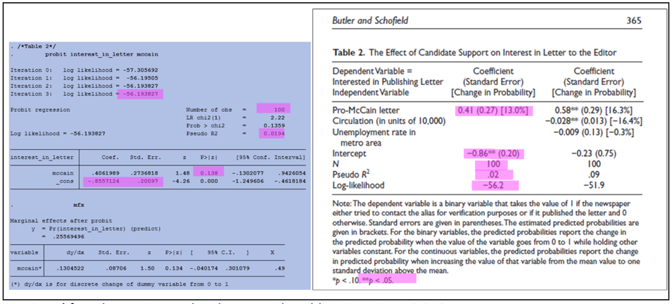

::::::::::::::::::::::::::::::::::::::: objectives

- Understand the importance of code output and manuscript review to curating for reproducibilty practice
- Compare code outputs with manuscript results to identify discrepancies
- Understand how to address inconsistencies found during code output and manuscript review

::::::::::::::::::::::::::::::::::::::::::::::::::

:::::::::::::::::::::::::::::::::::::::: questions

- Why is output review an essential component of curating code for reproducibility?
- What are outputs and why are they important?
- What are the essential steps in output and manuscript review?

::::::::::::::::::::::::::::::::::::::::::::::::::

You reviewed files, documentation, and data. You ran the code and confirmed that it is error-free. You are now ready for a key part of curating for reproducibility: comparing the output produced by the code with the findings reported in the article!

## Manuscript Results

An initial step in assessing reproducibility is inspecting the manuscript to identify all analysis results appearing in tables, graphs, figures, and in-text references.  For the purposes of this lesson, we use the term "manuscript" to refer to a working paper, draft, preprint, article under review, or a published article.

Inspecting the manuscript requires a close reading of the entire document, which may include appendices and supplementary materials.  The goal of this task is to confirm that the code includes the commands needed to reproduce tables and figures, as well as results appearing as in-line text and not referenced in tables, figures, and/or graphs.

To facilitate this process, curators may highlight sections of the manuscript where results appear. Doing so will make it easier to compare code outputs to the results in the manuscript. The next exercise offers an opportunity to practice this technique.

:::::::::::::::::::::::::::::::::::::::  challenge

## Exercise: Identifying Manuscript Results

Perform a manuscript inspection by doing a close reading of the entire manuscript and highlighting sections of the manuscript that present analysis results.  Be sure that you highlight all figures, tables, graphs, and in-text numbers.

:::::::::::::::  solution

## Solution

solution

:::::::::::::::::::::::::

::::::::::::::::::::::::::::::::::::::::::::::::::

## Code Outputs

When code executes successfully, the program will display the results of the computations, i.e., code outputs.  Sometimes, these outputs can be difficult to interpret by non-domain experts, or simply because the outputs lack the neat formatting of tables, figures, and graphs seen in the manuscript. In other cases, code may generate outputs in an order that does not align with the orientation of results in the manuscript.  Output files and log files can make it easier to locate and interpret code outputs for code output and manuscript review purposes.

### Output files

Depending on how it is written, the code may include commands or scripts that produce output files that contain an image of a graph, figure, table, or some other result, which is often embedded in the manuscript.  These output files are standalone artifacts that are included in the research compendium. Below are some output file examples:

{alt='Output files'}

### The log file

The log file is of particular importance in the reproducibility assessment process because it not only can present code outputs in a readable format, but also it serves as a record of the analytical workflow.  The log file provides a written log of the computational events that occurred during a given session during which the program was executed.  The log file can be generated automatically or manually, and typically serves as a reference for researchers as they write or revise the manuscript. Below is an example log:

{alt='Log file example'}

For curators, the log file can be useful because results are written into the log (with the exception of graphs), which can be used to reference code outputs when assessing whether or not the research compendium can be used to reproduce manuscript results. The image below shows an example of code and a section of the log file that the code produced:

{alt='Code and the section of the log the code produced'}

:::::::::::::::::::::::::::::::::::::::::  callout

## Spotlight: When Data are Restricted

For some research compendium, data files cannot be included because they contain personally identifiable informationn (PII), protected health information (PHI), or otherwise restricted data that cannot be shared publicly, even for curation purposes.  In these cases, the log file can provide evidence that the computational workflow was executed, and that it produced the outputs featured in the manuscript.

::::::::::::::::::::::::::::::::::::::::::::::::::

Like much of what we have been learning, descriptions of concepts and processes can seem abstract when reading about them alone. Making the connection from concept to practice takes time, and cultivating a new skill takes practice. Let's practice what we have learned in Lesson 3 thus far by digging into outputs from a real life study.

:::::::::::::::::::::::::::::::::::::::  challenge

## Identifying Code Outputs

In the sample research compendium, the researcher has included a log file that includes code outputs.  Review the log closely to identify code outputs. Highlight all sections of the log that show code outputs.

:::::::::::::::  solution

## Solution

solution

:::::::::::::::::::::::::

::::::::::::::::::::::::::::::::::::::::::::::::::

## Comparing Code Outputs to Reported Results

The examples below show the output of specific code blocks alongside their corresponding results presented in the manuscript.

**Crosstab and Chi-Square (Stata):**
{alt='Crosstab output and manuscript results'}

**Probit regression (Stata):**
{alt='Probit regression and manuscript results'}

### Verifying Reproducibility

Verifying reproducibility requires that the results reported in the manuscript are compared against outputs generated by the code.  Any inconsistencies found when comparing code outputs to corresponding results in the manuscript indicates irreproducibility.

Inconsistencies can appear in several ways, from differences in decimal rounding and mislabeled graphs, to more significant discrepancies as shown in the example below:

{alt='Example of code output and manuscript results discrepancy'}

:::::::::::::::::::::::::::::::::::::::  challenge

## Exercise: Comparing Code Outputs to Manuscript Results

Using the manuscript and log file from the previous exercises, compare the code outputs highlighted in the log file and the results highlighted in the manuscript.  List any discrepancies you find between code outputs and corresponding results in the manuscript.

:::::::::::::::  solution

## Solution

solution

:::::::::::::::::::::::::

::::::::::::::::::::::::::::::::::::::::::::::::::

The checklist below outlines the tasks completed during the code output and manuscript review as part of the code review component of the curation for reproducibility workflow.

:::::::::::::::::::::::::::::::::::::::  checklist

## Checklist: Code Output and Manuscript Review

- Review the manuscript, including appendices and supplemental materials, to locate and highlight analysis results displayed in figures, tables, graphs, and in-text numbers.
- Review the log file to locate and highlight code outputs.
- Match the highlighted code outputs in the log file to the highlighted results in the manuscript.
- Compare code outputs to manuscript results to confirm an exact match of numerical results
- If output files are included in the compendium, compare figures, graphs, and tables in the output files to the figures, graphs, and tables in the manuscript.
- Document any discrepancy--no matter how minor--found between the code outputs and manuscript results
  

::::::::::::::::::::::::::::::::::::::::::::::::::

### Addressing Inconsistencies

When inconsistencies are discovered during the code output and manuscript results comparison, they should be documented in enough detail so that the researcher is able to locate the discrepancy and take corrective actions to resolve the inconsistencies.  
It is highly recommended that researchers run their code and verify their results themselves prior to submitting their compendium for curator review. Researchers know their research best and can spot and address problems more quickly than any third party can.

More often than not, there are simple explanations for these inconsistencies. The vast majority of researchers share their compendia in good faith and with the expectation that their code will reproduce their reported results.  As the first re-users of the research compendium, curators can flag these inconsistencies so that researchers have the opportunity to make corrections *before* sharing it publicly.

Continue to [Lesson 4: Compendium Packaging and Publishing](https://curating4reproducibility.org/cure-carpentry-04-packaging/) of the Curating for Reproducibility curriculum to learn about considerations for sharing the research compendium.

:::::::::::::::::::::::::::::::::::::::: keypoints

- Every table, figure, and in-text number in the manuscript should be accounted for in code outputs.
- The curating for reproducibilty workflow includes identifying specific commands in code files that produce outputs, and then verifying that reported results can be reproduced using that code.
- Curators should document discrepanices found during the code output and manuscript review process and take steps to address them.

::::::::::::::::::::::::::::::::::::::::::::::::::

